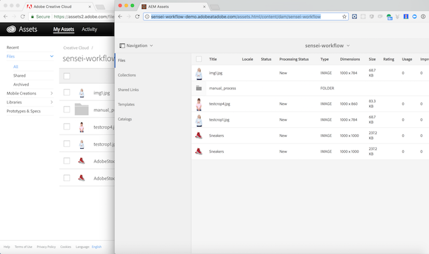

## Demo

Demo the workflow (Dawn 15 mins on demo/Adobe Sensei functions)

## Serverless Overview
- Overview of serverless and other OpenWhisk related terms (slides URL?)

- `action` - 
- `composition` -
- `rule` - 
- `trigger` - 

<a href="index.html" class="btn btn-default"><i class="glyphicon glyphicon-chevron-left"></i> Previous</a>
<a href="lesson2.html" class="btn btn-default pull-right">Next <i class="glyphicon
glyphicon-chevron-right"></i></a>

