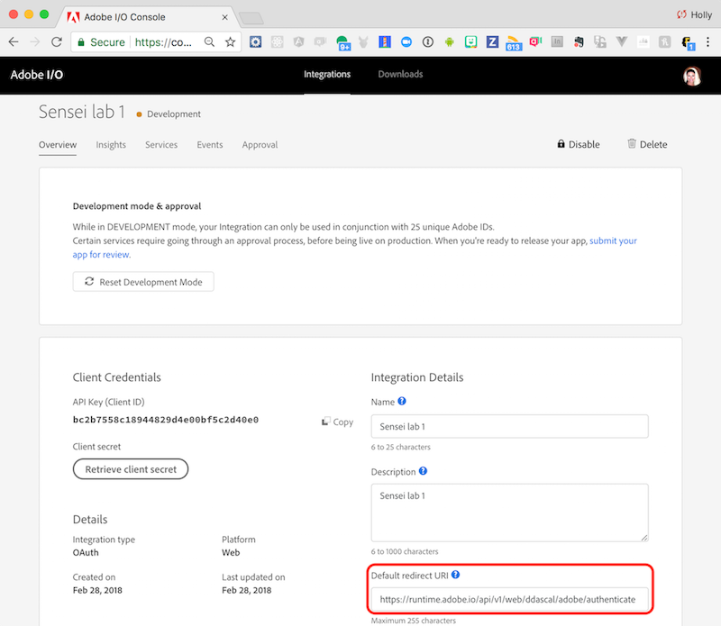
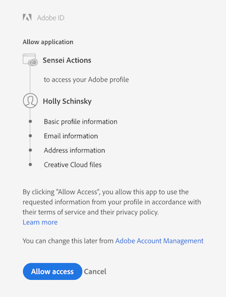
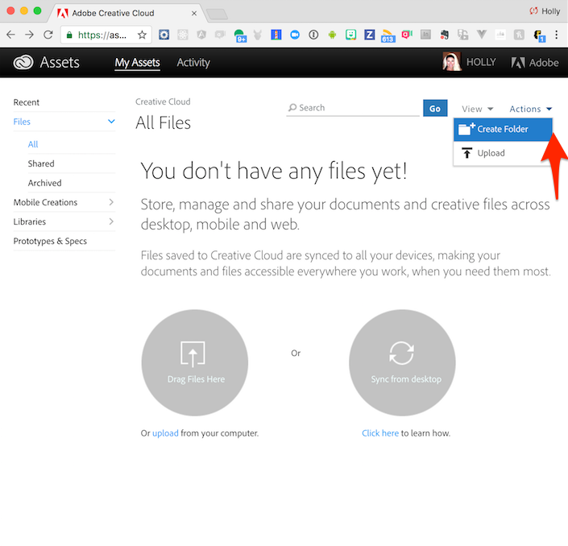

## Overview
The Adobe I/O Console provides the definitive destination for any developer looking to engage with and integrate Adobe cloud, mobile, and web technologies.

## Adobe Console Integration Setup
1. Open your browser to the [Adobe I/O Console](https://console.adobe.io).
2. Login with your pre-defined CC id and pw.
3. Ensure the **Integrations** tab is selected, then locate the integration by the name of `Sensei lab X` (where X is your assigned lab #) and click on it.
4. Once it's open, locate the **Default redirect URI** for your assigned user number and copy it. For instance, the one assigned to user **Sensei Lab 1** is outlined in red below:

  

  > This URL will be different for each user so make sure you locate the one for your specific user number.

5. Open the URL copied from the **Default redirect URI** in the previous step to authorize your app to access your Creative Cloud files. When it is run the first time, you will receive a pop-up like below, where you should click on the **Allow Access** button:

  

  > Don't worry if you did not receive the pop-up, it may have been run already in a previous lab. 

   You will then be re-routed to the Adobe Creative Cloud site where you can login with the Creative Cloud userid/pw provided to you for the lab.

6. Once logged in, look for the **Creative Cloud Files** link under **Assets** and click on it. 

7. **IMPORTANT** Before moving on, you must create your own personal folder to be used throughout this workshop. On the top right, click on the Actions arrow and choose to Create Folder from the options:

   

  Name it `sensei-lab-x` where x is your assigned lab user number.

<a href="lesson2.html" class="btn btn-default"><i class="glyphicon glyphicon-chevron-left"></i> Previous</a>
<a href="lesson4.html" class="btn btn-default pull-right">Next <i class="glyphicon
glyphicon-chevron-right"></i></a>

