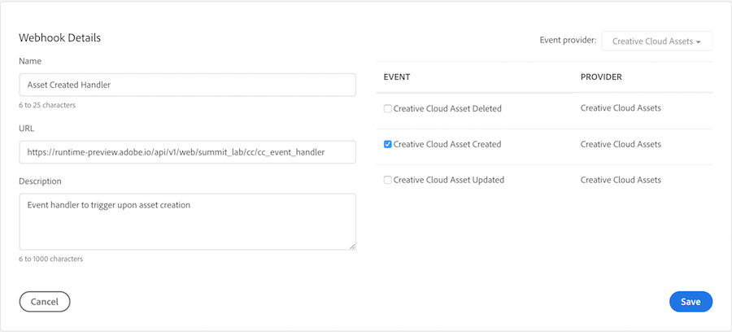

## Overview
Create a new integration (or update an existing one) to listen to Adobe CC Events, and specifically the asset created event and configure a webhook.

## Exercises
Go to the [Adobe I/O Console](https://console.adobe.io) and ensure the **Integrations** tab is selected

**Question:** Will they be setting any of this up or just viewing the details of one set up for their namespace... update below accordingly...

### Update Existing Integration
1. Locate the integration by the name of (add name)
2. Select the Events tab and click the **Add Webhook** button
3. Register the URL `https://runtime-preview.adobe.io/api/v1/web/<namespace>/cc/cc_event_handler` as the webhook for the`Creative Cloud Asset Create` event

   

4. Click the **Save** button and wait for the webhook to verify the challenge correctly.
   
   >You will know when the webhook verifies properly when the status changes to **Active** and no error or warning was received.

<!--
### New Integration
1. Click the **New Integration** button

2. On the next page, choose the **Receive near-real time events** option

3. On the next page, choose **Creative Cloud Assets**
...
-->

## Resources

<a href="lesson3.html" class="btn btn-default"><i class="glyphicon glyphicon-chevron-left"></i> Previous</a>
<a href="lesson5.html" class="btn btn-default pull-right">Next <i class="glyphicon
glyphicon-chevron-right"></i></a>

