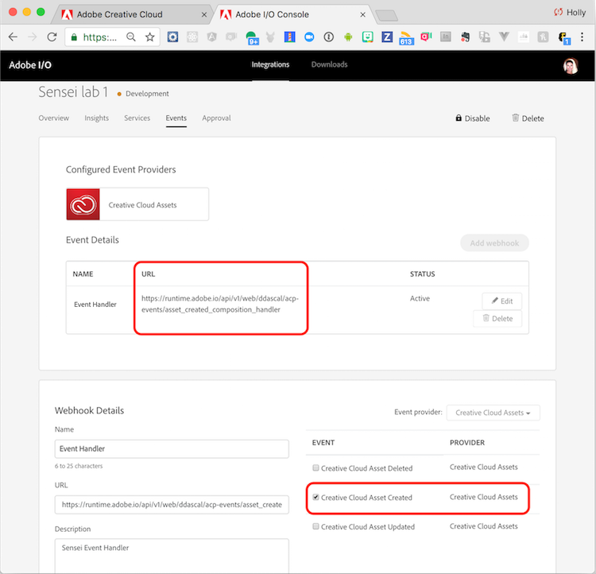
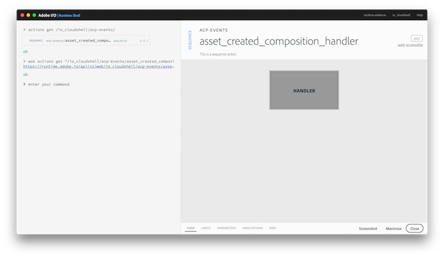

## Overview
Understand how your integration is configured with a webhook to respond to any Creative Cloud Asset Created Events.

## Exercises
1. Go back to the [Adobe I/O Console](https://console.adobe.io), ensure the **Integrations** tab is selected and click on your pre-defined integration again (ie: `Sensei lab X` - where X is your assigned lab #).

2. Select the **Events** tab and notice an item listed with the name **Sensei Event Handler**. Click on the Edit button to the right of it  item to expand the details of the configured webhook, like shown below:

  

  > Notice the items outlined in red in the screenshot. These two fields essentially define a URL endpoint event handler to be invoked any time the Creative Cloud Asset Created event occurs.

3. The URL defined for the webhook event handler is actually an `action` you could now view in the Adobe I/O Runtime Shell.

4. Switch back to the Adobe I/O Runtime Shell application and enter the following command:

      action list

    In the result you should see a SEQUENCE action with the name of `asset_created_composition_handler` in package `acp-events`. You can click on it to view more details.

  > The package name and action name are the parts of the URL following your designated namespace. So for instance, based on the URL `https://runtime.adobe.io/api/v1/web/sensei-lab-1/acp-events/asset_created_composition_handler`, your namespace/package name is: `sensei-lab-1/acp-events`. To view the actions in that package specifically, you could use the command: `actions get /sensei-lab-1/acp-events/`.

  

5. Click on the **Handler** action in it and take a look at the code definition briefly to see more details on how this handler works.

  An example of the log output from an invocation of this handler is shown below for reference:

  

<!-- SAVE FOR LATER SETUP 
### Update Existing Integration
1. Locate the integration by the name of (add name)
2. Select the Events tab and click the **Add Webhook** button
3. Register the URL `https://runtime-preview.adobe.io/api/v1/web/<namespace>/cc/cc_event_handler` as the webhook for the`Creative Cloud Asset Create` event

   

4. Click the **Save** button and wait for the webhook to verify the challenge correctly.
   >You will know when the webhook verifies properly when the status changes to **Active** and no error or warning was received.

### New Integration
1. Click the **New Integration** button

2. On the next page, choose the **Receive near-real time events** option

3. On the next page, choose **Creative Cloud Assets**
...
-->

<a href="lesson3.html" class="btn btn-default"><i class="glyphicon glyphicon-chevron-left"></i> Previous</a>
<a href="lesson5.html" class="btn btn-default pull-right">Next <i class="glyphicon
glyphicon-chevron-right"></i></a>

