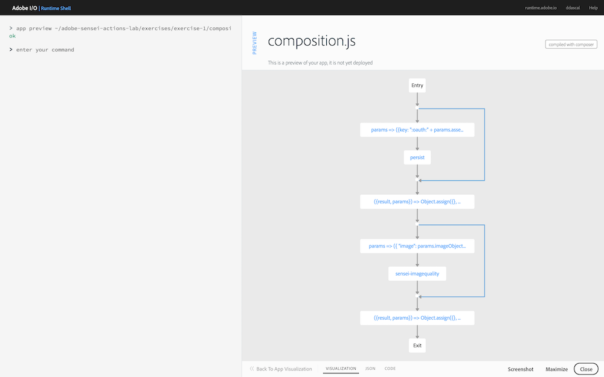

## Overview
In this exercise you will use the Adobe Sensei Image Quality function to retrieve an image aesthetic score.

## Steps
1. Open the **Visual Studio Code** application on your worksation located under the **Applications** folder (or in the dock toolbar).

2. Go to **File -> Open** and locate the folder for the exercises and solutions pre-loaded on your workstation in your user directory at `~/adobe-sensei-ai-functions`.

3. Begin by opening the `solutions/exercise-1/composition.js` file to learn about some specific concepts you'll need to understand for the remainder of the lab.
  
     `composer.sequence(task_1, task_2, ...)`
  
      > Runs a sequence of tasks where the output parameter from the 1st task in the sequence is the input parameter for the next task.

     `composer.retain(task)`
  
      > The `retain` call is a parameter retention function that produces an output with two fields: `params` and `result` where `params` is the input parameter of the composition and `result` is the output of `task`.
  
4. Using the Adobe I/O Runtime Shell, preview the exercise 1 composition with the following command to help visualize the app starting point:

       app preview ~/adobe-sensei-ai-functions/exercises/exercise-1/composition.js

5. Go back into Visual Studio Code and open `exercises/exercise-1/composition.js`. Locate the `TODO` block comment and add a call to the Sensei Image Quality function, which is defined using an action name of `/sensei/1.0/sensei-imagequality`. You'll need to pass in the `imageObject` parameter for `image` and retain the results.

     <!-- SOLUTION
     composer.retain(
      composer.sequence(
        params => ({
          "image": params.imageObject
        }),
      '/sensei/1.0/sensei-imagequality'
      )
    ),
    /* grab image quality results */
    ({result, params}) => Object.assign({}, result, params)-->

## Try it!
1. Preview your composition code to ensure your new changes are shown:

       app preview ~/adobe-sensei-ai-functions/exercises/exercise-1/composition.js

    

2. Update the current `asset_created_composition` app with your new version:

       app update asset_created_composition ~/adobe-sensei-ai-functions/exercises/exercise-1/composition.js

1. Now go back to the Creative Cloud instance you're logged into in the browser and and navigate into the new folder you created previously (**sensei-lab-1** for instance).

1. Drag and drop (or upload) an image from the workstation into the folder in Creative Cloud to trigger an `asset_created` event. There are images provided for you to use within the `~/adobe-sensei-ai-functions/images` folder.

1. Switch back to the Adobe I/O Runtime Shell and run the `session list` command to list all of the current sessions:

       session list
  
1. Locate the most recent `asset_created_composition` running and click on the session id to view the session. The `RESULT` tab displays the results in JSON format. If the Image Quality Sensei function was run successfully, it should contain an element named `scores` with values assigned for various attributes which are further explained below. The `quality` value ranges between 0-1 where a higher quality image results in a higher score. All of the other individual attributes contribute to the overall `quality` score.

    

   - **Balancing Element** - Looks for balance in composition, if the photo looks balanced/imbalanced 
   - **Color Harmony** - How balanced the colors are
   - **Interesting Content** - 
  Whether there's interesting content in the photo
   - **Interesting Lighting** - Colorful-ness in the lighting - night scene, sunset, interesting lighting effects. 
   - **Repetition** - Whether there's repetition (pattern, composition...) in the photo
   - **Symmetry** - Looks for symmetry in composition and object
   - **Depth of Field** - https://en.wikipedia.org/wiki/Depth_of_field
   - **Object Emphasis** - Whether there a main subject
   - **Rule of Thirds** - https://en.wikipedia.org/wiki/Rule_of_thirds
   - **Vivid Color** -	Saturation of color and visual reception

2. Next click on the **SESSION FLOW** tab. If your code ran successfully, you should see something like below, where all actions completed successfully and are denoted in green:

    

<a href="lesson4.html" class="btn btn-default"><i class="glyphicon glyphicon-chevron-left"></i> Previous</a>
<a href="lesson6.html" class="btn btn-default pull-right">Next <i class="glyphicon
glyphicon-chevron-right"></i></a>

