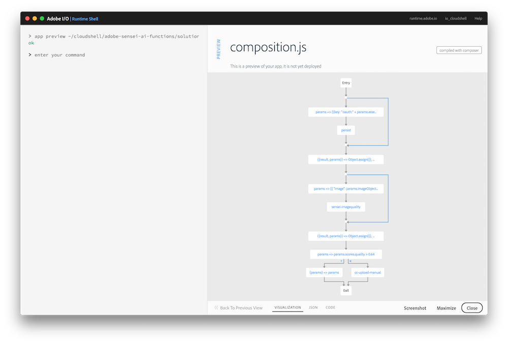

## Overview
In this exercise you will add code to check the quality score received from the previous Sensei Image Qualit action. When the quality score does not meet an accepted range, you will call an action to upload it back to Creative Cloud for manual processing.

## Steps
1. In Visual Studio Code, open the `exercises/exercise-2/composition.js` file. 

2. Locate the `TODO` comment block and add the following snippet:

        /* TODO: ... */
        ,composer.if(
          params => params.scores.quality > 0.64,
          /* if quality is met, process the image and upload to AEM */
          (params) => params,
          /* if quality is NOT met, copy asset to manual process folder in CC */
         '/adobe/acp-assets-0.5.0/cc-upload-manual')

   > **HINT:** Look back to the results of the previous exercise to remind you of the `quality` score returned for an image.

## Try it!
1. First preview your composition again to ensure your new changes are shown before moving on:

       app preview ~/adobe-sensei-actions-lab/exercises/exercise-2/composition.js

      

2. Next, update the currently deployed version of the `asset_created_composition` with your edited version:

       app update asset_created_composition ~/adobe-sensei-actions-lab/exercises/exercise-2/composition.js

3. Open the browser to your Creative Cloud instance and trigger the `Asset Created` event by uploading a low quality image into it. One has been included for you to use by the name of `~/adobe-sensei-actions-lab/images/quality-fail.png`.

5. Switch back to the Adobe I/O Runtime Shell to find your session:

       session list

6. Locate the most recent `asset_created_composition` running and click on the session id to view the result. When run successfully, the **SESSION FLOW** tab should show results like the screenshot below where the `cc-upload-manual` action executed quality score failure:

<a href="lesson5.html" class="btn btn-default"><i class="glyphicon glyphicon-chevron-left"></i> Previous</a>
<a href="lesson7.html" class="btn btn-default pull-right">Next <i class="glyphicon
glyphicon-chevron-right"></i></a>

