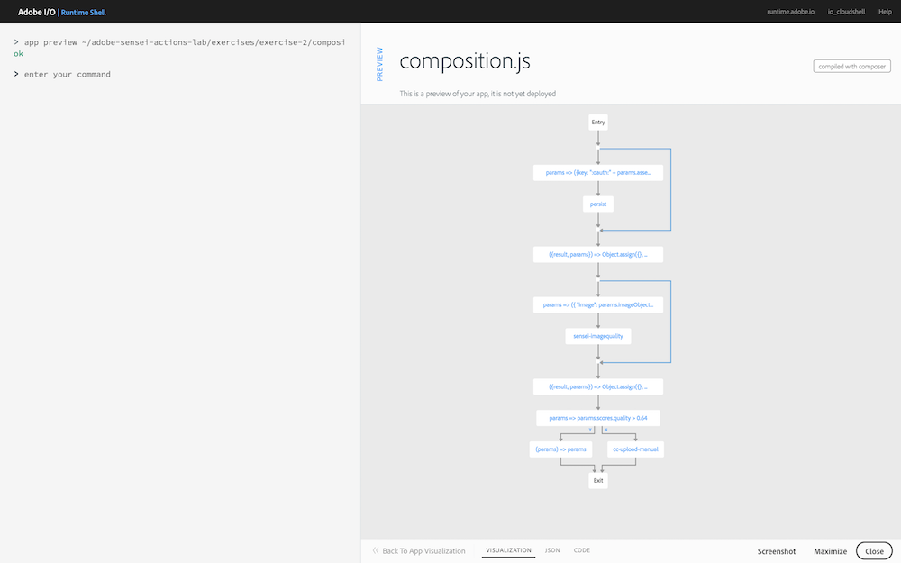

## Overview
In this exercise you will add an action to be used for uploading an asset to the creative cloud manually when a certain quality value is not met.

## Exercises
1. In VS Code, open `exercises/exercise-2/composition.js`. 

2. Locate the `TODO` comment block and code an action to check the image quality value from the previous step. If the quality is not met, upload it to the Creative Cloud manually using the `/adobe/acp-assets-0.5.0/cc-upload-manual` action.

   > HINT: You can check the `scores.quality` value off the `params` to determine the quality.
   
   <!-- 
    * TODO: check the image quality. If quality is not met, upload
    * the asset into a folder invoking the '/adobe/acp-assets-0.5.0/cc-upload-manual' action.
    * Use composer.if( <condition>, <then>, <else>) construct.
    * For <then> you can choose to simply return the params using: 
    * (params) => params
     */```

     SOLUTION
      composer.if(
        params => params.scores.quality > 0.64,
        /* if quality is met, process the image and upload to AEM */
        (params) => params,
        /* if quality is NOT met, copy asset to manual process folder in CC */
        '/adobe/acp-assets-0.5.0/cc-upload-manual')
     -->

## Try it!
1. First preview your composition again to ensure your new changes are shown:

       app preview ~/adobe-sensei-ai-functions/exercises/exercise-2/composition.js

      

2. Next update the current `asset_created_composition` app with your new version:

       app update asset_created_composition ~/adobe-sensei-ai-functions/exercises/exercise-2/composition.js

3. Now open the browser to your Creative Cloud folder previously created again and trigger an `asset_created` event by uploading the `~/adobe-sensei-ai-functions/images/exercise-2.png` image into it.

5. Switch back to the Adobe I/O Runtime Shell to find your session:

       session list

6. Locate the most recent `asset_created_composition` running and click on the session id to view the result.

<div class="row" style="margin-top:40px;">
<div class="col-sm-12">
<a href="lesson5.html" class="btn btn-default"><i class="glyphicon glyphicon-chevron-left"></i> Previous</a>
<a href="lesson7.html" class="btn btn-default pull-right">Next <i class="glyphicon
glyphicon-chevron-right"></i></a>
</div>
</div>
