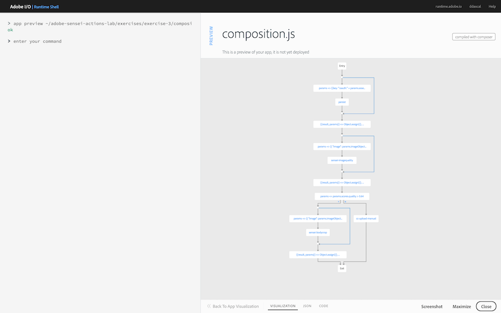
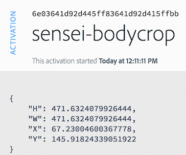

## Overview
In this exercise you will use the **Sensei Body Crop** action to identify reference points in the provided image to use for cropping out the body automatically.

## Steps
1. In Visual Studio Code, open `exercises/exercise-3/composition.js`. 
2. Just after the `TODO` block, add the code snippet below to invoke the `/sensei/1.0/sensei-bodycrop` action. The code will pass in the `image` object and save the result in a `crops` object. The result will contain the constraints recommended for cropping out the body of the image.
 
        /**
         *  TODO: Use the action '/sensei/1.0/sensei-bodycrop' to crop the body.
         */
        composer.retain(
            composer.sequence(
                params => ({
                    "image": params.imageObject
                }),
            '/sensei/1.0/sensei-bodycrop'
            )
        ),
        /* grab bodycrop results */
        ({result, params}) => Object.assign({},
            { crops: result },
            params
        )

## Try it!
1. First, preview your composition to ensure it contains the `sensei-bodycrop` action:

       app preview ~/adobe-sensei-actions-lab/exercises/exercise-3/composition.js

    

2. Next update the current `asset_created_composition` app with your new version:

       app update asset_created_composition ~/adobe-sensei-actions-lab/exercises/exercise-3/composition.js

3. Now open the browser to your Creative Cloud folder and upload a new image to trigger an `asset_created` event.

5. Switch back to the **Adobe I/O Runtime Shell** and type:

       session list

6. Locate the most recent `asset_created_composition` running and click on the session id to view the result. The response should contain the coordinates to crop, like shown below:
    
    

<a href="lesson6.html" class="btn btn-default"><i class="glyphicon glyphicon-chevron-left"></i> Previous</a>
<a href="lesson8.html" class="btn btn-default pull-right">Next <i class="glyphicon
glyphicon-chevron-right"></i></a>

