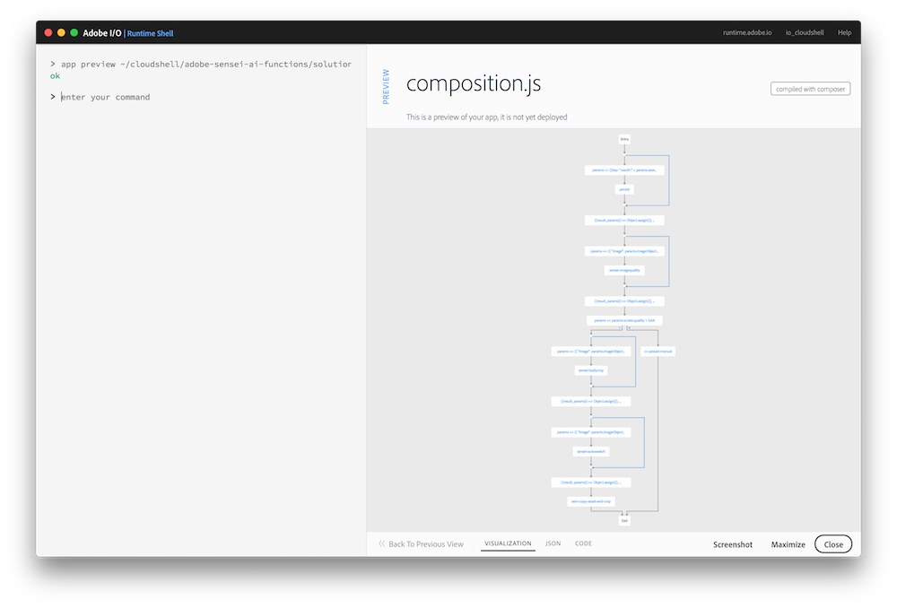

## Overview
In this exercise you will add the Sensei Auto Swatch function to automatically extract color swatches from your image, then call an AEM action that will copy and crop the asset for AEM.

## Steps
1. In Visual Studio Code, open the `exercises/exercise-4/composition.js` file.
2. Just after the `TODO` block, add code to invoke the `/sensei/1.0/sensei-autoswatch` action to crop the body of the image. The parameters you'll need to pass are:

    - `image` - the image object to use for swatches
    - `results` - max number of swatches to return
    - `size` - size of the swatch (or 0)
  
    Use the same `composer` constructs used for `sensei-imagequality` and be sure to grab the results.

<!--Solution:
     /**
       * Invoke '/sensei/1.0/sensei-autoswatch'
       */
      composer.retain(
        composer.sequence(
          params => ({
            "image": params.imageObject,
            "results": 2,
            "size": 0
          }),
        '/sensei/1.0/sensei-autoswatch'
        )
      ),
      /* grab autoswatch results */
      ({result, params}) => Object.assign({}, result, params),
      /** Copy asset to AEM 
       *  invoking '/adobe/acp-assets-0.5.0/aem-copy-asset-and-crop' action
       */
      '/adobe/acp-assets-0.5.0/aem-copy-asset-and-crop'
    ),-->

## Try it!

1. First preview your composition again to ensure your new changes are shown:

       app preview ~/adobe-sensei-ai-functions/exercises/exercise-4/composition.js

      

2. Next update the current `asset_created_composition` app with your new version:

       app update asset_created_composition ~/adobe-sensei-ai-functions/exercises/exercise-4/composition.js

3. Now open the browser to your Creative Cloud folder previously created again and trigger an `asset_created` event by uploading the `~/adobe-sensei-ai-functions/images/exercise-4.png` image into it.

5. Switch back to the Adobe I/O Runtime Shell and type:

       session list

6. Locate the most recent `asset_created_composition` running and click on the session id to view the result.

7. If the app ran successfully then you should see the asset copied into AEM (with the same folder name as you defined in the Creative Cloud) using the AEM instance and credentials below to login:

    AEM instance: `http://52.151.23.3:4502/`
    userid: `labadmin`
    pw: `jumpyice54!!`

<a href="lesson7.html" class="btn btn-default"><i class="glyphicon glyphicon-chevron-left"></i> Previous</a>
<a href="lesson9.html" class="btn btn-default pull-right">Next <i class="glyphicon
glyphicon-chevron-right"></i></a>

