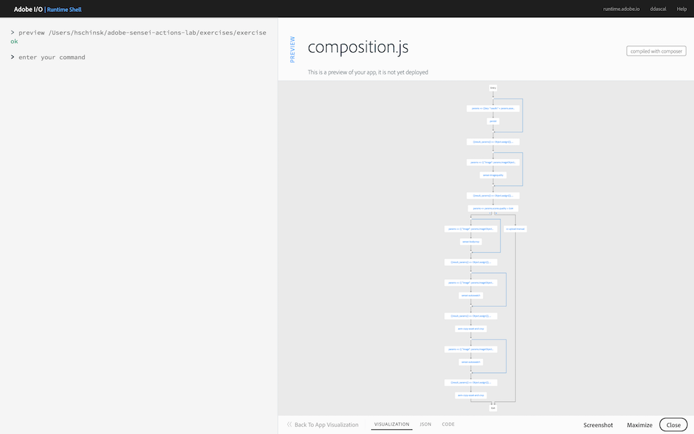
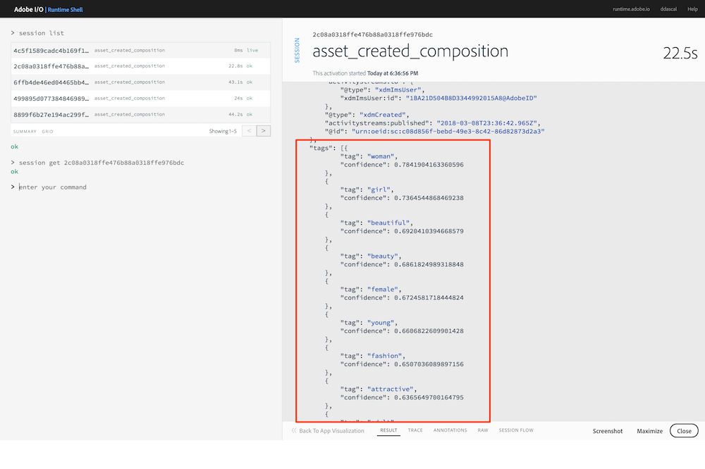
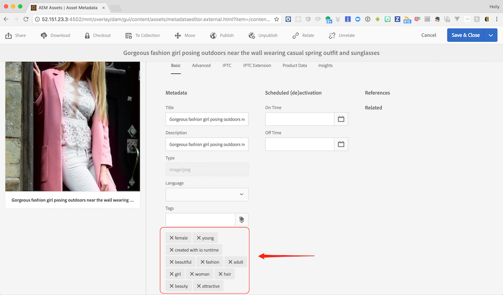

## Overview
In this exercise you will add the Sensei Auto Tag function to auto tag an image followed by the AEM Update Tags action to update the tags for the image in AEM.

## Steps
1. In Visual Studio Code, open the `exercises/exercise-5/composition.js` file. 
2. Just after the `TODO` block, begin adding code to call the `/sensei/1.0/sensei-autotag` action to predict tags for the image. The parameters you'll need to pass are:

    - `image` - the image object to use for swatches
    - `confidence` - level of confidence from 0-1 where 1 is the highest confidence
    - `results` - number of tags to return

          /**
           * TODO: Autotag the image invoking '/sensei/1.0/sensei-autotag' action.
           */
          composer.retain(
            composer.sequence(
              params => ({
                "image": params.imageObject,
                "confidence": 0.5,
                "results": 10
              }),
            '/sensei/1.0/sensei-autotag',
            (r) => { r.tags.push({"tag": "created with io runtime", "confidence":"1"}); return r; }
            )
          ),
          /* grab autotag results */
          ({result, params}) => Object.assign({}, result, params),

3. After the tags have been assigned, the image needs to be updated in AEM to include them. After the autotag result has been returned, add the following code to call an action to update the tags for the image in AEM:

            /**
              * TODO: Update the tags in AEM Assets
              *  by invoking '/adobe/acp-assets-0.5.0/aem-update-tags'
              */
              '/adobe/acp-assets-0.5.0/aem-update-tags',
              /**
              * Return the result as-is
              */
              result => result
            ),

## Try it!
1. First, preview your composition again to ensure your new changes are shown:

       app preview ~/adobe-sensei-actions-lab/exercises/exercise-5/composition.js

      

2. Next, update the current `asset_created_composition` with your new version:

       app update asset_created_composition ~/adobe-sensei-actions-lab/exercises/exercise-5/composition.js

3. Now open the browser to your Creative Cloud and upload an image to trigger an `asset_created` event.

4. Switch back to the **Adobe I/O Runtime Shell** and type:

       session list

5. Locate the most recent `asset_created_composition` running and click on the session id to view the result. If you scroll down in the results JSON you should see the tags that were generated like shown in the session below:

      

6. If the app ran successfully then you will see the asset copied into an AEM instance within the same folder name as you defined in your Creative Cloud instance. 

    > **NOTE:** Use the AEM host and credentials provided to login and check AEM for the file.

    Once you locate the file uploaded into AEM, either hover over it and click the circled **i** button (or click into it and click on **Properties**) to view the details and check for the existence of tags. One of them should say `created with io runtime` as shown below:

      

   

    

<a href="lesson8.html" class="btn btn-default"><i class="glyphicon glyphicon-chevron-left"></i> Previous</a>

