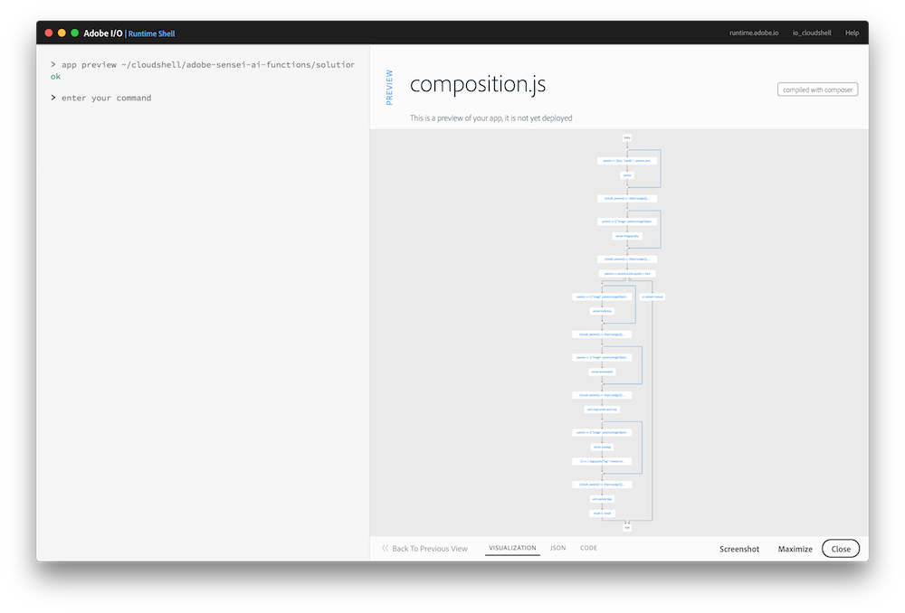

## Overview
In this exercise you will add the Sensei Auto Tag function to ... and use the AEM Update Tags action to update the tags for the image in AEM.

## Steps
1. In VS Code, open `exercises/exercise-5/composition.js`. 

<!--Solution:
     /**
       * TODO: Autotag the image invoking '/sensei/1.0/sensei-autotag' action.
       */
      composer.retain(
        composer.sequence(
          params => ({
            "image": params.imageObject,
            "confidence": 0.5,
            "results": 10
          }),
        '/sensei/1.0/sensei-autotag',
        (r) => { r.tags.push({"tag": "created with io runtime", "confidence":"1"}); return r; }
        )
      ),
      /* grab autotag results */
      ({result, params}) => Object.assign({}, result, params),
      /**
       * TODO: Update the tags in AEM Assets
       *  by invoking '/adobe/acp-assets-0.5.0/aem-update-tags'
       */
      '/adobe/acp-assets-0.5.0/aem-update-tags',
      /**
       * Return the result as-is
       */
      result => result
    ),-->

## Try it!

1. First preview your composition again to ensure your new changes are shown:

       app preview ~/adobe-sensei-ai-functions/exercises/exercise-5/composition.js

      

2. Next update the current `asset_created_composition` app with your new version:

       app update asset_created_composition ~/adobe-sensei-ai-functions/exercises/exercise-5/composition.js

3. Now open the browser to your Creative Cloud folder previously created again and trigger an `asset_created` event by uploading the `~/adobe-sensei-ai-functions/images/exercise-5.png` image into it.

5. Switch back to the Adobe I/O Runtime Shell and type:

       session list

6. Locate the most recent `asset_created_composition` running and click on the session id to view the result.

7. If the app ran successfully then you should see the asset copied into AEM (with the same folder name as you defined in the Creative Cloud) using the AEM instance and credentials below to login:

    AEM instance: `http://52.151.23.3:4502/`
    userid: `labadmin`
    pw: `jumpyice54!!
    

<a href="lesson8.html" class="btn btn-default"><i class="glyphicon glyphicon-chevron-left"></i> Previous</a>

