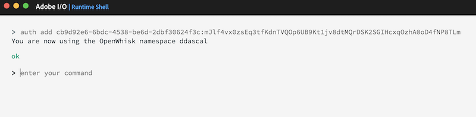

<!--
# Adobe I/O Runtime Shell
-->

## Overview
The Adobe I/O Runtime Shell is a graphical interface to help you visualize and debug your serverless functions and compositions with great ease. It has been pre-installed on your machine and you will use it throughout the workshop. Before using it however, you must authorize your namespace to give yourself your own sandbox to play in for the duration of this lab.

## Setup
1. Locate the **Adobe I/O icon**  in your application toolbar to open the **Adobe I/O Runtime Shell**.
2. Authorize your designated Adobe I/O Runtime namespace based on the auth key provided for your userid by entering the following command:

        auth add your_namespace_key_goes_here

    Verify you receive a response for your userid similar to below before continuing:

   

## Learning Exercises
1. Using the **Adobe I/O Runtime Shell**, create a new `app` (aka: `composition`) based on the built-in `hello.js` demo using the following command:

       app create hello-app @demos/hello.js

2. Next, invoke your `hello-app` with a `name` parameter:

       app invoke -p name sensei

3. Next, preview the built-in `if.js` demo to see an example of a composition with  a flow structure:

       app preview @demos/if.js

   

4. Take a moment to click on the **CODE** tab and notice how it uses the `authenticate` *action* as the condition, and takes the `welcome` or `login` action path depending on the result returned.

        composer.if(
            /* cond */
            'authenticate',
            /* then */
            'welcome',
            /* else */
            'login')

<a href="module1.html" class="btn btn-default"><i class="glyphicon glyphicon-chevron-left"></i> Previous</a>
<a href="module3.html" class="btn btn-default pull-right">Next <i class="glyphicon
glyphicon-chevron-right"></i></a>

