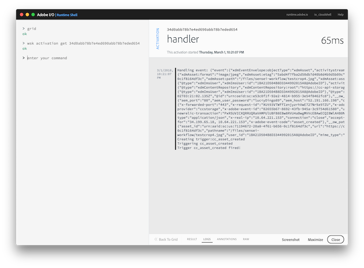
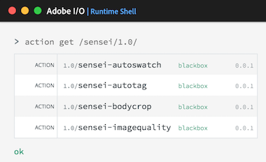

## Overview
Understand how your Adobe I/O integration is configured with a webhook action to respond to **Creative Cloud Asset Created** events.

## Steps
1. Go back to the [Adobe I/O Console](https://console.adobe.io), ensure the **Integrations** tab is selected and click on your pre-defined integration again (ie: `Sensei lab X` - where X is your assigned lab #).

2. Select the **Events** tab and notice an item listed with the name **Sensei Event Handler**. Click on the **Edit** button to the right of it  item to expand the details of the configured webhook, like shown below:

    

    > Notice the items outlined in red above. These two fields define a URL endpoint event handler to be invoked any time a Creative Cloud Asset Created event occurs.

3. The URL defined for the webhook event handler points to a pre-defined `action` you could now view in the Adobe I/O Runtime Shell. Switch back to the Adobe I/O Runtime Shell and use the `action get` command followed by your specific `namespace/package/handler` from the URL directly following the `https://runtime.adobe.io/api/v1/web` portion of the URL:

   For instance, if the URL was `https://runtime.adobe.io/api/v1/web/sensei-lab-1/acp-events/asset_created_composition_handler` you would run the following command:

        action get acp-events/asset_created_composition_handler

    In the result you should see a SEQUENCE action with the name of `asset_created_composition_handler` in package `acp-events`.

    

    > **NOTE:** You can also list actions specific to a namespace/package and use a command like: `actions get /sensei-lab-x/acp-events/` with your assigned namespace/lab number.

5. Click on the **HANDLER** action defined within the `asset_created_composition_handler` and take a look at the code definition briefly to see more details on how this handler works.

   An example of the log output from an invocation of this handler is shown below for reference:

     

6. Before leaving the Adobe I/O Runtime Shell, execute the `action get /sensei/1.0/` command to view the names of the Adobe Sensei functions currently defined in your namespace. You should see a list like the following. These actions will be used throughout the rest of the exercises to add specific Adobe Sensei functions.

   
  

<!-- SAVE FOR LATER SETUP 
### Update Existing Integration
1. Locate the integration by the name of (add name)
2. Select the Events tab and click the **Add Webhook** button
3. Register the URL `https://runtime-preview.adobe.io/api/v1/web/<namespace>/cc/cc_event_handler` as the webhook for the`Creative Cloud Asset Create` event

   

4. Click the **Save** button and wait for the webhook to verify the challenge correctly.
   >You will know when the webhook verifies properly when the status changes to **Active** and no error or warning was received.

### New Integration
1. Click the **New Integration** button

2. On the next page, choose the **Receive near-real time events** option

3. On the next page, choose **Creative Cloud Assets**
...
-->

<a href="module3.html" class="btn btn-default"><i class="glyphicon glyphicon-chevron-left"></i> Previous</a>
<a href="module5.html" class="btn btn-default pull-right">Next <i class="glyphicon
glyphicon-chevron-right"></i></a>

