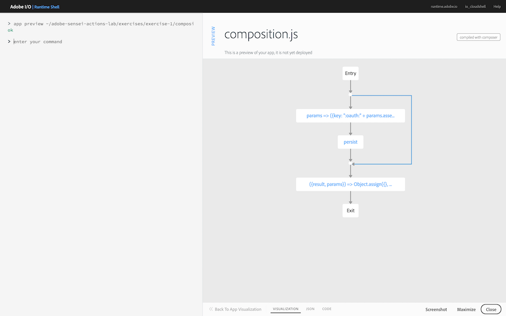

## Overview
In this exercise you will use the **Adobe Sensei Image Quality** action to retrieve aesthetic scores for an image, including an overall quality score.

## Steps
1. Open the **Visual Studio Code** application on your worksation located under the **Applications** folder (or in the dock toolbar).

2. Go to **File -> Open** and locate the folder for the exercises and solutions pre-loaded on your workstation in your user directory at `~/adobe-sensei-actions-lab`.

3. Begin by opening the `exercises/exercise-1/composition.js` file to learn about some specific concepts you'll need to understand for the remainder of the lab.
  
     `composer.sequence(task_1, task_2, ...)`
  
      > Runs a sequence of tasks where the output parameter from the 1st task in the sequence is the input parameter for the next task.

     `composer.retain(task)`
  
      > The `retain` call is a parameter retention function that produces an output with two fields: `params` and `result` where `params` is the input parameter of the composition and `result` is the output of `task`.
  
4. Before editing any code, go back into the **Adobe I/O Runtime Shell** application and preview the base composition flow with the following command:

       app preview ~/adobe-sensei-actions-lab/exercises/exercise-1/composition.js

    

5. Now switch back into your editor where the `exercises/exercise-1/composition.js` file is open, locate the `TODO` comment block and add the following:

       /* TODO: Invoke the /sensei/1.0/sensei-imagequality action
        * passing the imageObject as parameter */
       ,composer.retain(
         composer.sequence(
           params => ({
             "image": params.imageObject
           }),
         '/sensei/1.0/sensei-imagequality'
         )
       ),
       /* grab image quality results */
       ({result, params}) => Object.assign({}, result, params)

    This code will:
    
    1. Invoke the `/sensei/1.0/sensei-imagequality` action with a parameter named `image` set to the `imageObject` parameter (previously defined in the base composition code and extracted from the asset created event).
            
    2. Retain the result received from running the action for further use

## Try it!
1. Switch back into the **Adobe I/O Runtime Shell** and preview your updated composition flow with your changes. Make sure it contains the `sensei-imagequality` action in the visualization as shown below before moving on:

       app preview ~/adobe-sensei-actions-lab/exercises/exercise-1/composition.js

    

    > **NOTE:** Your visualization will automatically update to preview your latest version if you had it running while making your code edits.

2. Deploy the `asset_created_composition` with your updated version:

       app update asset_created_composition ~/adobe-sensei-actions-lab/exercises/exercise-1/composition.js

1. Now go back to the browser where your Creative Cloud instance is open and navigate into the new folder you created previously (ie: **sensei-lab-1**).

1. Drag and drop (or upload) an image from your workstation into your Creative Cloud folder to trigger an `asset_created` event.

    > **NOTE:** There are images provided for testing within your `~/adobe-sensei-actions-lab/images` folder.

1. Switch back to the **Adobe I/O Runtime Shell** application and run the `session list` command to list all of the current sessions:

       session list
  
1. Locate the most recent `asset_created_composition` running and click on the session id to view the session details.

   The `RESULT` tab displays the results in JSON format. If the Image Quality Sensei action ran successfully, you should see an element in the JSON named `scores`, with values assigned for attributes further explained below. The `quality` value is an overall score based on the rest of the individual attributes, and ranges between 0-1 where a higher quality image results in a higher score.

    

   - **Balancing Element** - How balanced the overall composition is
   - **Color Harmony** - How balanced the colors are
   - **Interesting Content** - Whether or not the image contains interesting content
   - **Interesting Lighting** - Colorful-ness in the lighting - night scene, sunset, interesting lighting effects...
   - **Repetition** - Whether there's repetition (pattern, composition...) in the photo
   - **Symmetry** - Based on symmetry in composition and object
   - **Depth of Field** - https://en.wikipedia.org/wiki/Depth_of_field
   - **Object Emphasis** - Detects if there's a main subject
   - **Rule of Thirds** - https://en.wikipedia.org/wiki/Rule_of_thirds
   - **Vivid Color** -	Saturation of color and visual reception

2. Next, click on the **SESSION FLOW** tab. If your code ran successfully you should see something similar to below, where all actions completed successfully and are denoted in green:

    

<a href="module4.html" class="btn btn-default"><i class="glyphicon glyphicon-chevron-left"></i> Previous</a>
<a href="module6.html" class="btn btn-default pull-right">Next <i class="glyphicon
glyphicon-chevron-right"></i></a>

