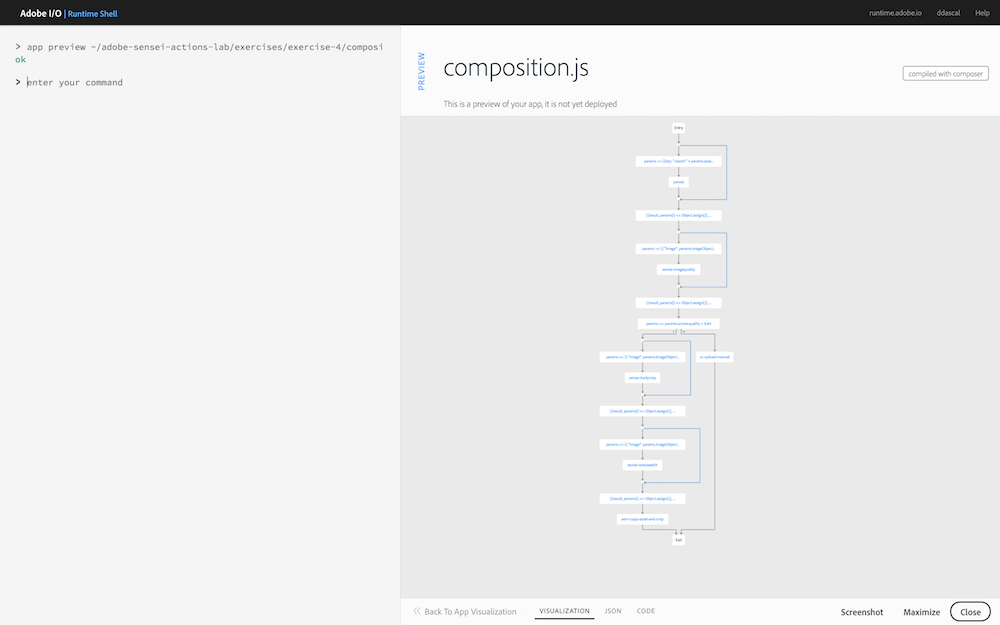
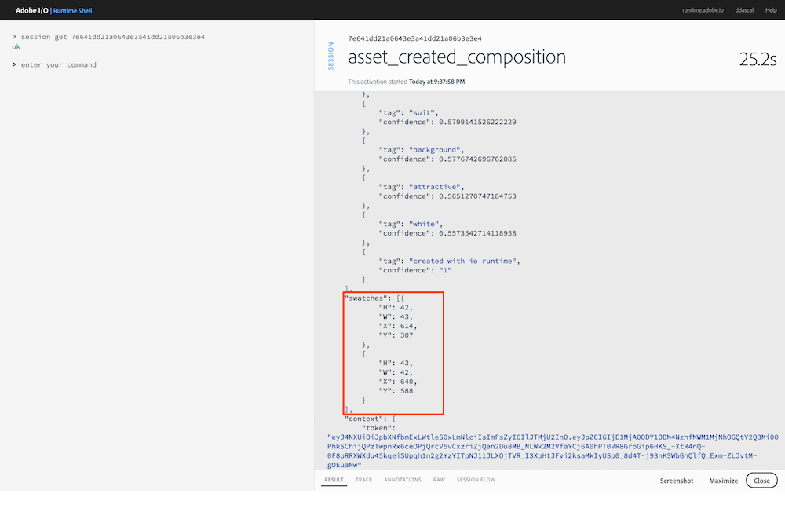
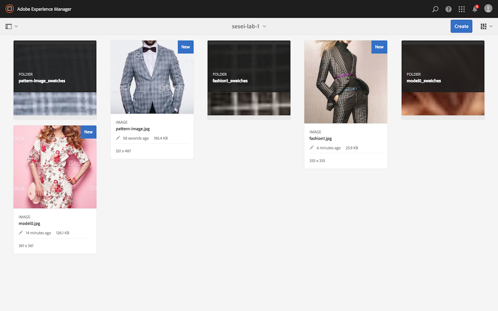
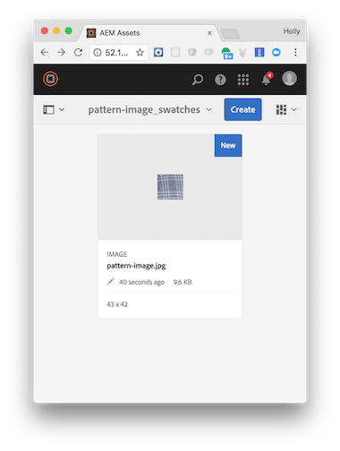

## Overview
In this exercise you will add the **Adobe Sensei Auto Swatch** function to automatically extract color swatches from your image, then call an AEM action that will crop and create swatches from your image, then copy them into AEM.

## Steps
1. In Visual Studio Code, open the `exercises/exercise-4/composition.js` file.
2. Just after the `TODO` block, add the following code to invoke the `/sensei/1.0/sensei-autoswatch` action to crop the body of the image. The parameters you're passing are:

    - `image` - the image object to use for swatches
    - `results` - max number of swatches to return
    - `size` - size of the swatch (or 0)

          /**
           * TODO: Invoke '/sensei/1.0/sensei-autoswatch'
           */
          composer.retain(
            composer.sequence(
              params => ({
                "image": params.imageObject,
                "results": 2,
                "size": 0
              }),
            '/sensei/1.0/sensei-autoswatch'
            )
          ),
          /* grab autoswatch results */
          ({result, params}) => Object.assign({}, result, params),

3. Now that the image quality has been checked and the crop and swatch results returned, the image is ready to be copied into AEM for final distribution.

    After the `sensei-autoswatch` results are returned, code the following action to perform the crops on the image and copy it into AEM:

          /** 
           *  TODO: Copy asset to AEM 
           *  invoking '/adobe/acp-assets-0.5.0/aem-copy-asset-and-crop' action
           */
          '/adobe/acp-assets-0.5.0/aem-copy-asset-and-crop'

    > **NOTE:** This action will also perform the actual cropping and swatch creation from the image prior to copying to AEM.

## Try it!
1. First, preview your composition again to ensure your new changes are shown:

       app preview ~/adobe-sensei-actions-lab/exercises/exercise-4/composition.js

      

2. Next, update the current `asset_created_composition` with your new version:

       app update asset_created_composition ~/adobe-sensei-actions-lab/exercises/exercise-4/composition.js

3. Now open the browser to your Creative Cloud and upload an image to trigger an `asset_created` event.

5. Switch back to the **Adobe I/O Runtime Shell** and type:

       session list

6. Locate the most recent `asset_created_composition` running and click on the session id to view the result. If you scroll down in the results JSON you should see the swatch results that were generated like shown in the session below:

      

7. If the app ran successfully then you will see the asset copied into an AEM instance (with the same folder name as you defined in the Creative Cloud).

    > **NOTE:** Use the AEM host and credentials provided to login and check AEM for the file.

    Notice the images now have the face cropped out and a new folder has been created to hold the swatches for the image sized based on the sensei-swatch action results:

      

      

    

<a href="module7.html" class="btn btn-default"><i class="glyphicon glyphicon-chevron-left"></i> Previous</a>
<a href="module9.html" class="btn btn-default pull-right">Next <i class="glyphicon
glyphicon-chevron-right"></i></a>

